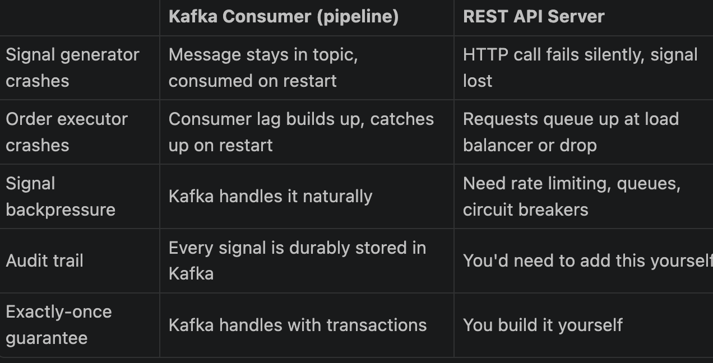

__Note:__ <i>This is a chat conversation with AI to finalize on the architecture. The raw conversation is being retained here for future reference and to revisit the reasoning behind key design decisions.</i>


### 2 more clarifying questions we are okay to have only last one row of the indicators table right or we need more?

<strong>Also since once the signal is generated we will need to trigger the order executor so do we need to push it again to kafka and have another pipeline for order executor or what exactly? like should this order executor be like a server and we hit an API on that which will internally call the brokers API and send us a confirmation once order is executed and we store it in our DB, how will this entire architecture or flow wil be. I am trying to understand complete picture first?__

Just wondering if this order executor should be a pipeline or a server with APIs like that bcz we want an instant execution and kafka is used as a buffer</strong>


#### Question 1: How Many Indicator Rows Do You Need?
Only 1 — the previous row. Here's why:

The current indicator values arrive in the Kafka message itself. You only query the DB to get the row before the current one — solely to detect crossovers (did something change between last candle and this one?).

Kafka message  →  current indicator  (ema_9=332.1, rsi=34.0, ...)
DB query       →  previous indicator (ema_9=331.8, rsi=29.5, ...)

RSI crossed above 30? → previous.rsi=29.5 < 30, current.rsi=34.0 > 30 → YES


That's all the history you need for the 4 strategies we're building. No rolling windows, no 50-row lookbacks — just current and previous.


#### Question 2: Kafka Pipeline vs API Server for Order Executor
This is a genuinely important architecture decision. Here's the honest answer:

Kafka pipeline is correct. Here's why your API concern is actually wrong:

The worry that "Kafka adds latency as a buffer" is only valid at microsecond-level HFT. At your scale (1-minute candles, signals firing every few minutes), Kafka end-to-end latency is 2–10ms. That is irrelevant. A broker API call itself takes 50–500ms. You're not losing anything.

The real question is: what are the failure modes?



```text
Signal Generator
    │
    ├── writes signal → signals table (DB)
    └── produces signal → signals topic (Kafka)
                              │
                         Order Executor (Kafka Consumer)
                              │
                              ├── risk checks (position size, market hours, existing positions)
                              ├── calls broker API → place order
                              ├── receives fill confirmation
                              └── writes order/fill → orders table (DB)

```


-> When would an API server make sense? Only if you need external systems to trigger orders on demand — like a human clicking a button in a dashboard, or a separate system that isn't Kafka-connected. In that case you'd have both: a Kafka consumer for automated signals AND an API endpoint for manual/external triggers. But that's a later problem.

__The Full End-to-End Picture__


```text
WebSocket (Finnhub/Fyers)
    → Kafka: raw-trades
        → Normalizer Consumer
            → Kafka: trades-normalized
                → Candle Builder Consumer
                    → Kafka: candles
                    → DB: candles table
                        → Indicator Consumer
                            → Kafka: indicators
                            → DB: indicators table
                                → Signal Generator Consumer    ← building now
                                    → Kafka: signals
                                    → DB: signals table
                                        → Order Executor Consumer  ← after this
                                            → Broker API
                                            → DB: orders table

Every stage is a Kafka consumer. Every stage writes to its own DB table. Every stage has a DLT. Consistent pattern all the way through.


-----------------------------------------------------------------------------------------------------------


<strong> Also I know there are two ways of faster processing one is parallelize using multiprocessing where we process multiple independent tasks all in parallel, one is concurrency using async, where we do the other tasks during the time one task is undergoing processing and we awaiting for its results.

Was thinking will parallel processing be not more efficient in computing all the strategies since all are independent?

Since you are a senior principal engineer at an HFT firm and I value your reviews, Do not modify or implement anything, just review the code of this current pipeline and suggest the design improvements as I have suggested. </strong>


Response:  
asyncio.gather for strategies gives you nothing — and multiprocessing would make it worse

This is the answer to your parallelism question. Strategy computations are pure Python arithmetic — a few comparisons and subtractions. Each one takes ~1–5 microseconds.

asyncio.gather = concurrent, not parallel. It interleaves coroutines on one thread. For I/O-bound tasks (waiting on network, DB) it helps. For CPU arithmetic it adds coroutine scheduling overhead with zero gain.
multiprocessing = true parallelism, but spawning a process or even using a ProcessPoolExecutor costs 1–10ms of IPC overhead per call. That's 1,000× more expensive than the computation itself.
The right answer for 4 strategy functions doing arithmetic: call them sequentially as plain sync functions. Total time is still under 50 microseconds. Reserve asyncio.gather for the two I/O operations at the end (ingest_into_db + produce_signal) where you're already using it correctly.